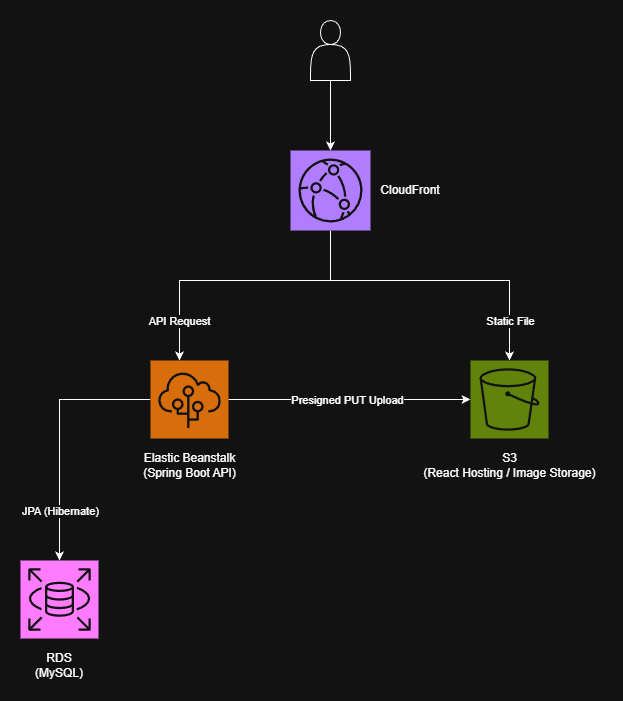
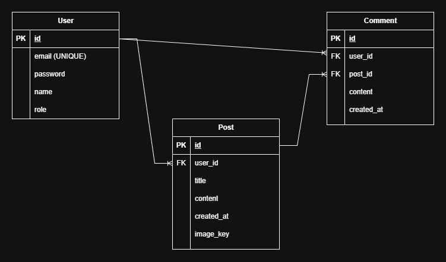

# 🚀 React + Spring Boot Portfolio Project

React 프론트엔드와 Spring Boot 백엔드로 구현한 웹 서비스 포트폴리오 프로젝트입니다.  
세션 기반 인증, 권한(Role) 기반 인가, 관리자 기능, 게시판 CRUD를 중심으로 웹 서비스의 기본 흐름과 서버 아키텍처를 구현했습니다.

배포 환경에서 GitHub Actions 기반 CI/CD 자동 배포까지 구성했습니다.

---

## 🔗 Demo

- URL: https://d1144r6alf0hee.cloudfront.net/

### Demo Account

ADMIN
id: admin
pw: 123

USER
회원가입 후 사용 가능


---

## 🛠 Tech Stack

### Frontend
- React (Vite)
- JavaScript (ES6+)
- Axios
- React Router

### Backend
- Java 21
- Spring Boot
- Spring Security
- Spring Data JPA (Hibernate)

### Database
- MySQL (AWS RDS)

### Infra / DevOps
- AWS S3
- AWS CloudFront
- AWS Elastic Beanstalk
- GitHub Actions

---

## ☁️ AWS Architecture



## ERD




## ✨ Core Features

### ✅ Authentication (인증)

- 회원가입  
  - 비밀번호 BCrypt 암호화 저장
- 로그인  
  - Spring Security 기반 인증  
  - 인증 성공 시 세션에 사용자 정보 저장
- 로그인 유지  
  - 이후 요청 시 세션 기반 인증 복원
- 로그아웃  
  - 세션 무효화
- 회원탈퇴
  - 본인 계정만 탈퇴 가능

---

### ✅ Authorization (인가)

- USER / ADMIN 권한 분리
- 관리자 전용 API 접근 제한

---

### ✅ User

- 마이페이지  
  - 내 이메일 / 이름 / 권한 조회
  - 내가 작성한 글 목록 조회

---

### ✅ Admin

- 전체 유저 목록 조회
- 유저 권한 변경 (USER ↔ ADMIN)
- 유저 삭제  
  - 자기 자신 삭제 방지 로직 적용

---

### ✅ Board (게시판)

- 게시글 작성
- 게시글 목록 조회
- 게시글 상세 조회
- 게시글 수정
- 게시글 삭제
- 작성자 본인만 수정/삭제 가능
- 게시글 이미지 업로드 (AWS S3 Presigned URL 방식)

---

### ✅ Comment (댓글)

- 댓글 작성
- 댓글 목록 조회
- 댓글 수정
- 댓글 삭제
- 작성자 본인만 수정/삭제 가능

---

### ✅ Image Upload (AWS S3)

- Presigned URL 발급 API 구현
- 클라이언트가 S3로 직접 업로드
- 서버에는 이미지 Key만 저장
- 게시글 조회 시 S3 이미지 URL 생성 후 제공

---

### ✅ Pagination (페이지네이션)

- 게시글 목록 페이지네이션 처리
- Spring Data JPA Pageable 사용
- 페이지 번호 / 페이지 크기 파라미터 지원
- 공통 PageResponse DTO 사용
- 프론트엔드에서 페이지 이동 UI 제공

---

### ✅ Post Search (게시글 검색)

- 제목 / 내용 기반 키워드 검색
- 검색어 + 페이지네이션 동시 지원
- JPA Custom Query 사용
- 검색 조건이 없으면 전체 목록 조회

---


### ✅ API Documentation

- Swagger(OpenAPI) 연동
- 모든 API 엔드포인트 테스트 가능

## 🧱 Backend Design

- Controller / Service / Repository 계층 분리
- Entity ↔ DTO 분리
- 비즈니스 로직은 Service 계층에만 위치
- 트랜잭션 기반 데이터 처리 (`@Transactional`)
- JPA Dirty Checking 활용

---

## 🔐 Security

- Spring Security Filter Chain 구성
- BCryptPasswordEncoder 적용
- 세션 기반 인증 방식 사용
- Role 기반 API 접근 제어

---

## ⚠ Exception Handling

- 전역 예외 처리 (`@RestControllerAdvice`)
- Validation 오류 메시지 공통 응답 처리
- 프론트엔드 Axios Interceptor를 통한 공통 에러 처리

---

## 🔁 CI/CD

### Backend

- GitHub Actions
- Gradle Build
- JAR 빌드 후 Elastic Beanstalk 자동 배포

### Frontend

- GitHub Actions
- React Build
- S3 업로드
- CloudFront 캐시 무효화

---

## 📂 Project Structure (Backend)

```
com.htm.react_springboot_2
├─ admin
├─ auth
├─ comment
├─ global
│  ├─ config
│  ├─ dto
│  └─ exception
├─ image
├─ post
└─ user
```

## 🔑 OAuth2 Social Login (Google)

- Google OAuth2 로그인 기능 구현
- Spring Security OAuth2 Client 사용
- OAuth 인증 성공 시:
- CustomOAuth2UserService에서 사용자 정보 가공
- 기존 회원이면 로그인 처리
- 신규 회원이면 자동 회원가입 처리
- 인증 완료 후 프론트엔드로 리다이렉트

---

## 📈 Why This Project?

- 로그인부터 관리자 기능까지 웹 서비스 전체 흐름 경험
- 인증 / 인가 구조 직접 설계
- 프론트엔드와 백엔드 분리 배포 경험
- CI/CD 자동화 경험

---
